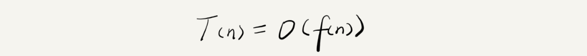
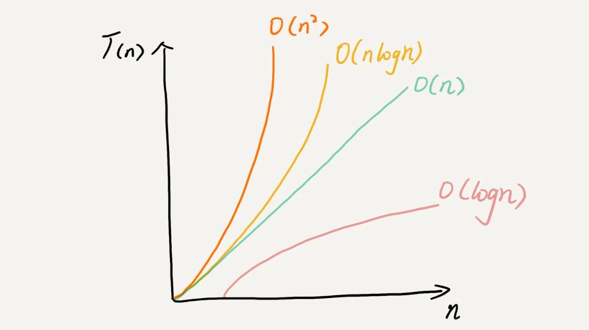
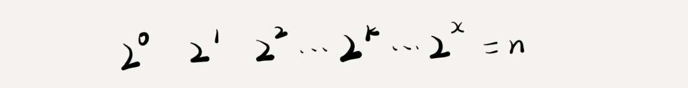
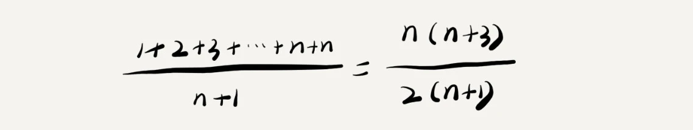
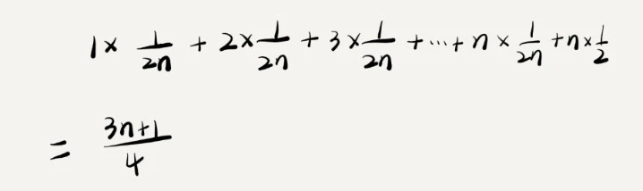

数据结构与算法要解决的问题是“快”和“省”，快指的是时间，省指的是空间
## 为什么需要复杂度分析？不可以使用数据直接测出来吗？
1. 测试的结果依赖环境，不同cpu的电脑运算速度不一样，得出的结论也不一样
2. 测试结果跟数据规模有关，不同算法适应的数据规模不同
   
## 我们需要一个不用具体的测试数据来测试，就可以粗略地估计算法的执行效率的方法，复杂度分析法
```c
 int cal(int n) {
   int sum = 0;
   int i = 1;
   int j = 1;
   for (; i <= n; ++i) {
     j = 1;
     for (; j <= n; ++j) {
       sum = sum +  i * j;
     }
   }
 }
```
当我们开始分析时，假定每行代码运行的时间相同，所以整个程序运行的时间具与每行代码的数量和每行代码的执行次数有关
即T(n) = (2n2+2n+3)*unit_time ，f(n)=2n2+2n+3
具体解释一下这个公式。其中，T(n)它表示代码执行的时间；n 表示数据规模的大小；f(n) 表示每行代码执行的次数总和。为了表示更简洁更牛B一些，所以用 f(n) 来表示。
即T（n）=f(n)*unit_time
我们不知道 unit_time 的具体值，所以所有代码的执行时间 T(n) 与每行代码的执行次数 f(n) 成正比。
我们可以把这个规律总结成一个公式。

这就是大 O 时间复杂度表示法。大 O 时间复杂度实际上并不具体表示代码真正的执行时间，而是表示代码执行时间随数据规模增长的变化趋势，所以，也叫作渐进时间复杂度（asymptotic time complexity），简称时间复杂度。
当 n 很大时，你可以把它想象成 10000、100000。而公式中的低阶、常量、系数三部分并不左右增长趋势，所以都可以忽略。我们只需要记录一个最大量级就可以了
### 具体分析时间复杂度的技巧
1. 只关注循环次数最多的一段代码
2. 总的时间复杂度就等于量级最大的那段代码的时间复杂度
3. 乘法法则：嵌套代码的复杂度等于嵌套内外代码复杂度的乘积

### 复杂度量级
越高阶复杂度的算法，执行效率越低。常见的复杂度并不多，从低阶到高阶有：O(1)、O(logn)、O(n)、O(nlogn)、O(n2 )


1. O（1）
   O(1) 只是常量级时间复杂度的一种表示方法，并不是指只执行了一行代码。比如这段代码，即便有 3 行，它的时间复杂度也是 O(1），而不是 O(3)。
   ```c
    int i = 8;
    int j = 6;
     int sum = i + j;
   ```


2. O(logn)、O(nlogn)
```c
 i=1;
 while (i <= n)  {
   i = i * 2;
 }
```
根据我们前面讲的复杂度分析方法，第三行代码是循环执行次数最多的。所以，我们只要能计算出这行代码被执行了多少次，就能知道整段代码的时间复杂度。从代码中可以看出，变量 i 的值从 1 开始取，每循环一次就乘以 2。当大于 n 时，循环结束。还记得我们高中学过的等比数列吗？实际上，变量 i 的取值就是一个等比数列。如果我把它一个一个列出来，就应该是这个样子的：

所以，我们只要知道 x 值是多少，就知道这行代码执行的次数了。通过 2x=n 求解 x 这个问题我们想高中应该就学过了，我就不多说了。x=log2n，所以，这段代码的时间复杂度就是 O(log2n)。
实际上，不管是以 2 为底、以 3 为底，还是以 10 为底，我们可以把所有对数阶的时间复杂度都记为 O(logn)。为什么呢？我们知道，对数之间是可以互相转换的，log3n 就等于 log32 * log2n，所以 O(log3n) = O(C * log2n)，其中 C=log32 是一个常量。基于我们前面的一个理论：在采用大 O 标记复杂度的时候，可以忽略系数，即 O(Cf(n)) = O(f(n))。所以，O(log2n) 就等于 O(log3n)。因此，在对数阶时间复杂度的表示方法里，我们忽略对数的“底”，统一表示为 O(logn).
如果一段代码的时间复杂度是 O(logn)，我们循环执行 n 遍，时间复杂度就是 O(nlogn) 了。


3. O(m+n)、O(m*n)
```c
int cal(int m, int n) {
  int sum_1 = 0;
  int i = 1;
  for (; i < m; ++i) {
    sum_1 = sum_1 + i;
  }

  int sum_2 = 0;
  int j = 1;
  for (; j < n; ++j) {
    sum_2 = sum_2 + j;
  }

  return sum_1 + sum_2;
}
```
从代码中可以看出，m 和 n 是表示两个数据规模。我们无法事先评估 m 和 n 谁的量级大，所以我们在表示复杂度的时候，就不能简单地利用加法法则，省略掉其中一个。所以，上面代码的时间复杂度就是 O(m+n)。

### 具体情况分析时间复杂度（当出现条件时）
1. 最好时间复杂度，最坏时间复杂度
```c
// n表示数组array的长度
int find(int[] array, int n, int x) {
  int i = 0;
  int pos = -1;
  for (; i < n; ++i) {
    if (array[i] == x) {
       pos = i;
       break;
    }
  }
  return pos;
}
```
查找的变量 x 可能出现在数组的任意位置。如果数组中第一个元素正好是要查找的变量 x，那就不需要继续遍历剩下的 n-1 个数据了，那时间复杂度就是 O(1)。但如果数组中不存在变量 x，那我们就需要把整个数组都遍历一遍，时间复杂度就成了 O(n)。所以，不同的情况下，这段代码的时间复杂度是不一样的。
- 最好情况时间复杂度就是，在最理想的情况下，执行这段代码的时间复杂度。就像我们刚刚讲到的，在最理想的情况下，要查找的变量 x 正好是数组的第一个元素，这个时候对应的时间复杂度就是最好情况时间复杂度。
- 最坏情况时间复杂度就是，在最糟糕的情况下，执行这段代码的时间复杂度。就像刚举的那个例子，如果数组中没有要查找的变量 x，我们需要把整个数组都遍历一遍才行，所以这种最糟糕情况下对应的时间复杂度就是最坏情况时间复杂度。
- 要查找的变量 x 在数组中的位置，有 n+1 种情况：在数组的 0～n-1 位置中和不在数组中。我们把每种情况下，查找需要遍历的元素个数累加起来，然后再除以 n+1，就可以得到需要遍历的元素个数的平均值，即：
  
  我们知道，时间复杂度的大 O 标记法中，可以省略掉系数、低阶、常量，所以，咱们把刚刚这个公式简化之后，得到的平均时间复杂度就是 O(n)。这个结论虽然是正确的，但是计算过程稍微有点儿问题。究竟是什么问题呢？我们刚讲的这 n+1 种情况，出现的概率并不是一样的。我带你具体分析一下。（这里要稍微用到一点儿概率论的知识，不过非常简单，你不用担心。）我们知道，要查找的变量 x，要么在数组里，要么就不在数组里。这两种情况对应的概率统计起来很麻烦，为了方便你理解，我们假设在数组中与不在数组中的概率都为 1/2。另外，要查找的数据出现在 0～n-1 这 n 个位置的概率也是一样的，为 1/n。所以，根据概率乘法法则，要查找的数据出现在 0～n-1 中任意位置的概率就是 1/(2n)。因此，前面的推导过程中存在的最大问题就是，没有将各种情况发生的概率考虑进去。如果我们把每种情况发生的概率也考虑进去，那平均时间复杂度的计算过程就变成了这样：
  
 这个值就是概率论中的加权平均值，也叫作期望值，所以平均时间复杂度的全称应该叫加权平均时间复杂度或者期望时间复杂度。引入概率之后，前面那段代码的加权平均值为 (3n+1)/4。用大 O 表示法来表示，去掉系数和常量，这段代码的加权平均时间复杂度仍然是 O(n)。
2. 均摊时间复杂度
它对应的分析方法，摊还分析（或者叫平摊分析）。
```c
 // array表示一个长度为n的数组
 // 代码中的array.length就等于n
 int[] array = new int[n];
 int count = 0;
 
 void insert(int val) {
    if (count == array.length) {
       int sum = 0;
       for (int i = 0; i < array.length; ++i) {
          sum = sum + array[i];
       }
       array[0] = sum;
       count = 1;
    }

    array[count] = val;
    ++count;
 }
```
这段代码实现了一个往数组中插入数据的功能。当数组满了之后，也就是代码中的 count == array.length 时，我们用 for 循环遍历数组求和，并清空数组，将求和之后的 sum 值放到数组的第一个位置，然后再将新的数据插入。但如果数组一开始就有空闲空间，则直接将数据插入数组。
 **特别的是**
  1. 首先，find() 函数在极端情况下，复杂度才为 O(1)。但 insert() 在大部分情况下，时间复杂度都为 O(1)。只有个别情况下，复杂度才比较高，为 O(n)。这是 insert()第一个区别于 find() 的地方。
  2. 我们再来看第二个不同的地方。对于 insert() 函数来说，O(1) 时间复杂度的插入和 O(n) 时间复杂度的插入，出现的频率是非常有规律的，而且有一定的前后时序关系，一般都是一个 O(n) 插入之后，紧跟着 n-1 个 O(1) 的插入操作，循环往复。
 - 针对这种特殊的场景，我们引入了一种更加简单的分析方法：摊还分析法，通过摊还分析得到的时间复杂度我们起了一个名字，叫均摊时间复杂度。

每一次 O(n) 的插入操作，都会跟着 n-1 次 O(1) 的插入操作，所以把耗时多的那次操作均摊到接下来的 n-1 次耗时少的操作上，均摊下来，这一组连续的操作的均摊时间复杂度就是 O(1)。这就是均摊分析的大致思路。