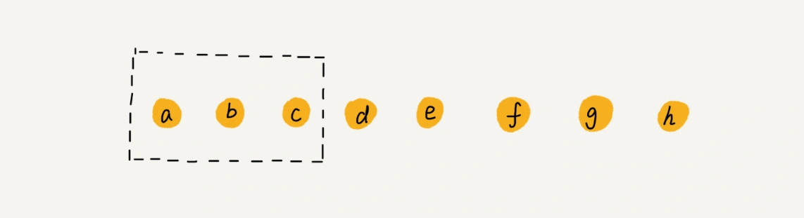

### 什么是数组？
数组是一种线性表数据结构，使用一块连续的内存空间，存储内容为相同的数据类型

- 线性表（只有一个前驱，一个后继）：数组，链表，队列，栈
- 非线性表：树，图

### 数组下标为什么从零开始？
要解释这个要从数组的内存地址计算公式来看
```
a[k]_address = base_address + k * type_size
```
当数组的下标为0时，数组a[0]的地址即为base_address，即首地址，所以就如一些编程语言定义一样，数组名即为数组首地址。
最重要的是理解是 ，
***“下标”最确切的定义应该是“偏移（offset）”***
a[0]就是偏移为 0 的位置，也就是首地址，a[k]就表示偏移 k 个 type_size 的位置

还有两个可能原因
1. 从 1 开始编号，每次随机访问数组元素都多了一次减法运算，对于 CPU 来说，就是多了一次减法指令。
2. C 语言设计者用 0 开始计数数组下标，之后的 Java、JavaScript 等高级语言都效仿了 C 语言，或者说，为了在一定程度上减少 C 语言程序员学习 Java 的学习成本，因此继续沿用了从 0 开始计数的习惯。实际上，很多语言中数组也并不是从 0 开始计数的，比如 Matlab。甚至还有一些语言支持负数下标，比如 Python。

### 特性一：高效的随机访问
根据内存地址计算公式
```
a[i]_address = base_address + i * data_type_size
```
随机访问，根据下标随机访问的时间复杂度为 O(1)。
### 特性二：低效的插入和删除
**插入** 
1. 数组中的数据是有序的
假设数组的长度为 n，现在，如果我们需要将一个数据插入到数组中的第 k 个位置。为了把第 k 个位置腾出来，给新来的数据，我们需要将第 k～n 这部分的元素都顺序地往后挪一位。
如果在数组的末尾插入元素，那就不需要移动数据了，这时的时间复杂度为 O(1)。但如果在数组的开头插入元素，那所有的数据都需要依次往后移动一位，所以最坏时间复杂度是 O(n)。 因为我们在每个位置插入元素的概率是一样的，所以平均情况时间复杂度为 (1+2+...n)/n=O(n)。
2. 数组中的数据是无序的
如果要将某个数据插入到第 k 个位置，为了避免大规模的数据搬移，我们还有一个简单的办法就是，直接将第 k 位的数据搬移到数组元素的最后，把新的元素直接放入第 k 个位置。
那么在第 k 个位置插入一个元素的时间复杂度就会降为 O(1)

**删除**
和插入类似，如果删除数组末尾的数据，则最好情况时间复杂度为 O(1)；如果删除开头的数据，则最坏情况时间复杂度为 O(n)；平均情况时间复杂度也为 O(n)。

***在某些特殊场景下，我们并不一定非得追求数组中数据的连续性。如果我们将多次删除操作集中在一起执行，删除的效率是不是会提高很多呢？***
数组 a[10]中存储了 8 个元素：a，b，c，d，e，f，g，h。现在，我们要依次删除 a，b，c 三个元素。

为了避免 d，e，f，g，h 这几个数据会被搬移三次，我们可以先记录下已经删除的数据。每次的删除操作并不是真正地搬移数据，只是记录数据已经被删除。当数组没有更多空间存储数据时，我们再触发执行一次真正的删除操作，这样就大大减少了删除操作导致的数据搬移。
如果你了解 JVM，你会发现，这不就是 JVM 标记清除垃圾回收算法的核心思想吗？没错，数据结构和算法的魅力就在于此，很多时候我们并不是要去死记硬背某个数据结构或者算法，而是要学习它背后的思想和处理技巧，这些东西才是最有价值的。如果你细心留意，不管是在软件开发还是架构设计中，总能找到某些算法和数据结构的影子。

### 警惕数组的访问越界问题
```c
int main(int argc, char* argv[]){
    int i = 0;
    int arr[3] = {0};
    for(; i<=3; i++){
        arr[i] = 0;
        printf("hello world\n");
    }
    return 0;
}
```
这段代码的运行结果并非是打印三行“hello word”，而是会无限打印“hello world”，这是为什么呢？

**函数体内的局部变量存在栈上，且是连续压栈。在Linux进程的内存布局中，栈区在高地址空间，从高向低增长。变量i和arr在相邻地址，且i比arr的地址大，所以arr越界正好访问到i。当然，前提是i和arr元素同类型，否则那段代码仍是未决行为。**

根据我们前面讲的数组寻址公式，a[3]也会被定位到某块不属于数组的内存地址上，而这个地址正好是存储变量 i 的内存地址，那么 a[3]=0 就相当于 i=0，所以就会导致代码无限循环。

**数组越界在 C 语言中是一种未决行为，并没有规定数组访问越界时编译器应该如何处理。因为，访问数组的本质就是访问一段连续内存，只要数组通过偏移计算得到的内存地址是可用的，那么程序就可能不会报任何错误。**

### 容器能否完全替代数组？
针对数组类型，很多语言都提供了容器类，比如 Java 中的 ArrayList、C++ STL 中的 vector
- 传统数组的局限性：

 固定长度：数组一旦创建，大小不可变。

 功能单一：缺少直接支持插入、删除、搜索等操作的方法。

 类型限制：某些语言中数组只能存储单一类型元素（如 Java 的基本类型数组）。

 手动管理：需要开发者自行处理扩容、越界等问题。
- 容器类的优势：

 动态调整大小：自动处理扩容（如 ArrayList 在 Java 中）。

 丰富的功能：内置添加、删除、排序、遍历等方法。

 类型安全：支持泛型（如 List<String>），避免类型错误。

 代码简洁性：减少底层细节操作，提高开发效率。