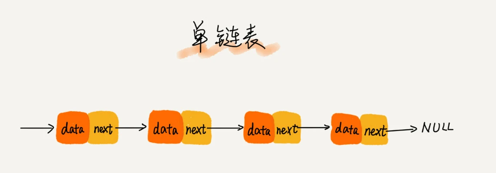
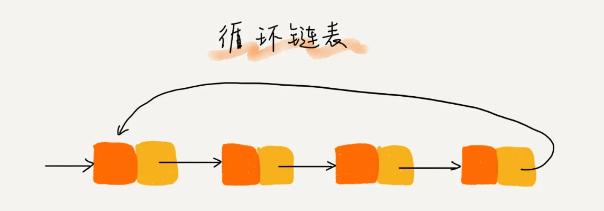
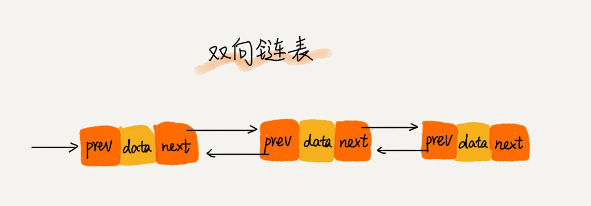
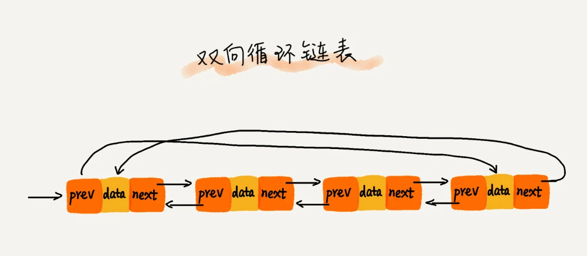

### 什么是链表？
当不足以开辟一块连续的内存建立线性表时，可以通过指针将一组零散的内存连接起来，就是链表
### 链表的结构
1. 单向链表
   
    我们把内存块称为链表的节点data
    为了将所有的结点串起来，每个链表的结点除了存储数据之外，还需要记录链上的下一个结点的地址，我们把记录下一个节点的地址的指针叫做后继指针next
 - 链表的查找O（n）
 - 链表的插入和删除O（1）
2. 循环链表
   
   循环链表的优点是从链尾到链头比较方便。当要处理的数据具有环型结构特点时，就特别适合采用循环链表。比如著名的约瑟夫问题。
3. 双向链表
   
   在实际的软件开发中，从链表中删除一个数据无外乎这两种情况：
   1. 删除结点中“值等于某个给定值”的结点；
   2. 删除给定指针指向的结点。
   - 对于第一种情况，不管是单链表还是双向链表，为了查找到值等于给定值的结点，都需要从头结点开始一个一个依次遍历对比，直到找到值等于给定值的结点，然后再通过我前面讲的指针操作将其删除。
   尽管单纯的删除操作时间复杂度是 O(1)，但遍历查找的时间是主要的耗时点，对应的时间复杂度为 O(n)。根据时间复杂度分析中的加法法则，删除值等于给定值的结点对应的链表操作的总时间复杂度为 O(n)。
   - 对于第二种情况，我们已经找到了要删除的结点，但是删除某个结点 q 需要知道其前驱结点，而单链表并不支持直接获取前驱结点，所以，为了找到前驱结点，我们还是要从头结点开始遍历链表，直到 p->next=q，说明 p 是 q 的前驱结点。
   - 同理，如果我们希望在链表的某个指定结点前面插入一个结点，双向链表比单链表有很大的优势。双向链表可以在 O(1) 时间复杂度搞定，而单向链表需要 O(n) 的时间复杂度
   - 除了插入、删除操作有优势之外，对于一个有序链表，双向链表的按值查询的效率也要比单链表高一些。因为，我们可以记录上次查找的位置 p，每次查询时，根据要查找的值与 p 的大小关系，决定是往前还是往后查找，所以平均只需要查找一半的数据。
  *** 这就是为什么在实际的软件开发中，双向链表尽管比较费内存，但还是比单链表的应用更加广泛的原因。如果你熟悉 Java 语言，你肯定用过 LinkedHashMap 这个容器。如果你深入研究 LinkedHashMap 的实现原理，就会发现其中就用到了双向链表这种数据结构。***
  *** 用空间换时间的设计思想***
  当内存空间充足的时候，如果我们更加追求代码的执行速度，我们就可以选择空间复杂度相对较高、但时间复杂度相对很低的算法或者数据结构。相反，如果内存比较紧缺，比如代码跑在手机或者单片机上，这个时候，就要反过来用时间换空间的设计思路。
  >缓存实际上就是利用了空间换时间的设计思想。如果我们把数据存储在硬盘上，会比较节省内存，但每次查找数据都要询问一次硬盘，会比较慢。但如果我们通过缓存技术，事先 将数据加载在内存中，虽然会比较耗费内存空间，但是每次数据查询的速度就大大提高了。
4. 双向循环链表
   

### 如何基于链表实现 LRU 缓存淘汰算法？
我们维护一个有序单链表，越靠近链表尾部的结点是越早之前访问的。当有一个新的数据被访问时，我们从链表头开始顺序遍历链表。
1. 如果此数据之前已经被缓存在链表中了，我们遍历得到这个数据对应的结点，并将其从原来的位置删除，然后再插入到链表的头部。
2. 如果此数据没有在缓存链表中，又可以分为两种情况：
- 如果此时缓存未满，则将此结点直接插入到链表的头部；
- 如果此时缓存已满，则链表尾结点删除，将新的数据结点插入链表的头部。
  **实际上，我们可以继续优化这个实现思路，比如引入散列表（Hash table）来记录每个数据的位置，将缓存访问的时间复杂度降到 O(1)。**